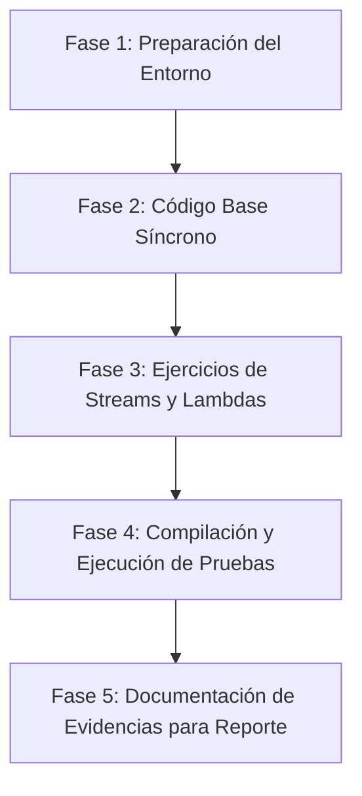

# MEMORY.md - Práctica: Cliente HTTP Moderno en Java (Java 11+)

## 1. Contexto y Objetivos del Proyecto
Esta práctica corresponde a la materia de **Sistemas Distribuidos**. El propósito es estudiar, implementar y verificar el funcionamiento de las nuevas APIs de red introducidas en Java 11 (`java.net.http`), enfocándose en:
- El uso de **`HttpClient`**, **`HttpRequest`** y **`HttpResponse`**.
- La aplicación del **patrón de diseño Builder** para la construcción controlada e inmutable de peticiones y clientes.
- La ejecución de peticiones HTTP síncronas hacia servicios de prueba (*echo*) como [httpbin.org](https://httpbin.org/get).
- El manejo adecuado de excepciones de red (`IOException`, `InterruptedException`).
- La integración y práctica de **expresiones Lambda** y **Java Streams** en el procesamiento de respuestas y encabezados HTTP.

---

## 2. Análisis Detallado del Material (Imágenes de la Práctica)

A partir de las tres imágenes proporcionadas se identifican los siguientes puntos clave:

### A. Patrón Builder (Imagen 1)
- **Problema de constructores convencionales**: `new HttpClient(null, null, null, 0, false, null)` requiere definir forzosamente todos los parámetros, propicia errores posicionales y rompe la extensibilidad cuando la clase evoluciona.
- **Solución con Builder**: Se utiliza `HttpClient.newBuilder()` y `HttpRequest.newBuilder()`. Permite una sintaxis fluida, legible, con parámetros opcionales y control estricto de inicialización culminando con `.build()`.

### B. Configuración de Componentes (Imagen 2 y 3)
1. **`HttpClient`**:
   - Versión de protocolo: HTTP 1.1 (`HttpClient.Version.HTTP_1_1`).
   - Timeout de conexión: 10 segundos (`Duration.ofSeconds(10)`).
2. **`HttpRequest`**:
   - Método: GET (`.GET()`).
   - Destino: `https://httpbin.org/get` (servicio echo que retorna en JSON los detalles de la petición: headers, IP pública, argumentos, URL).
   - Encabezado personalizado: `User-Agent` (por ejemplo `"Java 11 HttpClient Bot"`).
3. **`HttpResponse` y Envío Síncrono**:
   - Llamada bloqueante: `httpClient.send(request, HttpResponse.BodyHandlers.ofString())`.
   - El parámetro `HttpResponse.BodyHandlers.ofString()` actúa como traductor de bytes recibidos a texto `String`.
   - El objeto devuelto `HttpResponse<String>` almacena:
     - Código de estado HTTP (`response.statusCode()`).
     - Cuerpo del mensaje (`response.body()`).
     - Encabezados de respuesta (`response.headers()`).
4. **Manejo de Errores**:
   - Manejo de `IOException` e `InterruptedException` mediante cláusula `throws` en la firma de la función `main` en lugar de bloques verbosos de `try-catch`.

### C. Requerimiento de Ejercicios con Streams y Lambdas (Imagen 3)
- El documento indica explícitamente:
  > *"En los siguientes ejercicios intente programarlos preguntando a la IA lo necesario para aprender sobre streams y expresiones Lambda en Java. Envíe código fuente y capturas de pantalla como comprobantes de la presente práctica."*
- Esto implica:
  1. Compilar y ejecutar con éxito el ejemplo síncrono base de Mkyong.
  2. Implementar extensiones/ejercicios prácticos que utilicen Lambdas y la API de Streams (por ejemplo: filtrar encabezados específicos, transformar respuestas, ordenar y formatear datos devueltos por el servidor).
  3. Dejar el código listo y documentar los pasos de ejecución para que el usuario pueda capturar la evidencia (pantallazos) solicitada.

---

## 3. Plan de Implementación Propuesto



### Fase 1: Configuración del Entorno de Desarrollo
- **Estatus:** Verificado. Se cuenta con JDK 21 (`javac 21.0.12.1` / `java 21.0.12.1 LTS`).
- **Estructura de archivos:**
  - `src/HttpClientSynchronous.java`: Ejemplo base síncrono especificado en Mkyong.
  - `src/HttpClientStreamExercises.java`: Programa complementario enfocado en Streams y Expresiones Lambda para cumplir el requerimiento de la práctica.

### Fase 2: Implementación del Ejemplo Síncrono Base (`HttpClientSynchronous.java`)
- Implementar la clase de acuerdo al tutorial de Mkyong:
  - Definición del `HttpClient` con timeout de 10s y HTTP 1.1.
  - Creación del `HttpRequest` con método GET a `https://httpbin.org/get` y header `User-Agent`.
  - Envío síncrono con `httpClient.send(...)`.
  - Impresión de status code, body y headers usando la expresión lambda `(k, v) -> System.out.println(...)`.

### Fase 3: Desarrollo de Ejercicios Prácticos con Streams y Lambdas (`HttpClientStreamExercises.java`)
Para cubrir y profundizar en el aprendizaje de Streams y Lambdas requerido:
- **Ejercicio 1: Filtrado y búsqueda de Cabeceras (Stream Filter & Map)**:
  - Convertir el mapa de encabezados a un stream (`headers.map().entrySet().stream()`).
  - Filtrar cabeceras que comiencen con patrones específicos (e.g., `x-`, `content-`, `date`).
  - Formatear con `.map()` e imprimir con `.forEach()`.
- **Ejercicio 2: Estadísticas y agrupamiento**:
  - Contar encabezados que cumplan condiciones con `.filter().count()`.
  - Ordenar cabeceras alfabéticamente usando `.sorted(Map.Entry.comparingByKey())`.
- **Ejercicio 3: Procesamiento funcional de líneas del Body**:
  - Extraer las líneas del JSON de respuesta como un `Stream<String>` con `response.body().lines()`.
  - Aplicar transformaciones (`filter`, `map`, `collect`).

### Fase 4: Compilación, Ejecución y Pruebas
- Compilar ambos programas:
  ```powershell
  javac -d bin src/*.java
  ```
- Ejecutar y validar la respuesta HTTP real desde `httpbin.org`:
  ```powershell
  java -cp bin HttpClientSynchronous
  java -cp bin HttpClientStreamExercises
  ```

### Fase 5: Preparación de Comprobantes (Capturas de Pantalla y Código)
- Facilitar salidas claras y legibles en consola con separadores visuales.
- Proporcionar las instrucciones precisas para que el alumno obtenga las capturas de pantalla de la terminal requeridas para su entrega académica.

---

## 4. Ejercicios Realizados

### Ejercicio 1
- **Explicación solicitada de:** `HttpHeaders headers = response.headers();`
  - `response.headers()` devuelve un objeto inmutable de la clase `java.net.http.HttpHeaders`.
  - Representa todos los encabezados HTTP enviados por el servidor en la respuesta.
  - Almacena las cabeceras como pares clave-valor donde cada clave (`String`) mapea a una lista de cadenas (`List<String>`), ya que el protocolo HTTP permite que una misma cabecera se envíe varias veces (por ejemplo, múltiples `Set-Cookie` o cabeceras repetidas).
  - Ofrece métodos útiles como `.map()` (para obtener un `Map<String, List<String>>`), `.firstValue(nombre)` y `.allValues(nombre)`.
- **Sustitución realizada:**
  - Código original con lambda:
    ```java
    headers.map().forEach((k, v) -> System.out.println(k + ":" + v));
    ```
  - Código sustituido con iterador tradicional (`Iterator` sobre `Map.Entry<String, List<String>>`):
    ```java
    Map<String, List<String>> mapHeaders = headers.map();
    Iterator<Map.Entry<String, List<String>>> iterator = mapHeaders.entrySet().iterator();

    while (iterator.hasNext()) {
        Map.Entry<String, List<String>> entry = iterator.next();
        String nombreHeader = entry.getKey();
        List<String> valoresHeader = entry.getValue();
        System.out.println(nombreHeader + ":" + valoresHeader);
    }
    ```
  - Archivos creados:
    - [HttpClientSynchronous.java](file:///c:/Users/kaleb/SistemasDistribuidos/Practica/HttpClientSynchronous.java): Código base en la raíz de `Practica/`.
    - [Ejercicio1.java](file:///c:/Users/kaleb/SistemasDistribuidos/Practica/Ejercicio1.java): Implementación con `Iterator` en la raíz de `Practica/`.
    - [src/HttpClientSynchronous.java](file:///c:/Users/kaleb/SistemasDistribuidos/Practica/src/HttpClientSynchronous.java): Copia en subcarpeta `src/`.
    - [src/Ejercicio1.java](file:///c:/Users/kaleb/SistemasDistribuidos/Practica/src/Ejercicio1.java): Copia en subcarpeta `src/`.
    - [RESPUESTAS.md](file:///c:/Users/kaleb/SistemasDistribuidos/Practica/RESPUESTAS.md): Documento con todas las respuestas a las preguntas teóricas y del ejercicio.

### Ejercicio 2
- **Objetivo**: Crear un nuevo mapa mutable copiando las cabeceras obtenidas y agregar los valores para `Set-Cookie` ("Max-Age=0", "id=123", "theme=dark"), e imprimir usando `forEach`.
- **Implementación**:
  - Se utilizó un nuevo `HashMap<String, List<String>>`.
  - Se agregaron las cookies mediante `computeIfAbsent("Set-Cookie", k -> new ArrayList<>())`.
  - Archivos: [src/Ejercicio2.java](file:///c:/Users/kaleb/SistemasDistribuidos/Practica/src/Ejercicio2.java) y [Ejercicio2.java](file:///c:/Users/kaleb/SistemasDistribuidos/Practica/Ejercicio2.java).

### Ejercicio 3
- **Objetivo**: Retomar el código anterior y utilizar `entrySet()`, y los métodos `sorted()` y `forEach()` de la interfaz `Stream` para imprimir los headers ordenados alfabéticamente por su nombre (llave).
- **Implementación**:
  ```java
  nuevoMapaHeaders.entrySet()
          .stream()
          .sorted(Map.Entry.comparingByKey())
          .forEach(entry -> System.out.println(entry.getKey() + ":" + entry.getValue()));
  ```
  - Archivos: [src/Ejercicio3.java](file:///c:/Users/kaleb/SistemasDistribuidos/Practica/src/Ejercicio3.java) y [Ejercicio3.java](file:///c:/Users/kaleb/SistemasDistribuidos/Practica/Ejercicio3.java).

---

## 5. Estado de Progreso
- [x] Análisis del documento y de las 3 imágenes iniciales.
- [x] Creación de `MEMORY.md`.
- [x] Implementación de `HttpClientSynchronous.java`.
- [x] Implementación y explicación del `Ejercicio1.java` (Sustitución por `Iterator`).
- [x] Corrección de nombre de clase y finalización de `Ejercicio2.java` (`HashMap`, `Set-Cookie`, `forEach`).
- [x] Implementación de `Ejercicio3.java` (`entrySet()`, `stream().sorted(Map.Entry.comparingByKey())`, `forEach()`).
- [ ] Esperando siguientes ejercicios de la práctica.

